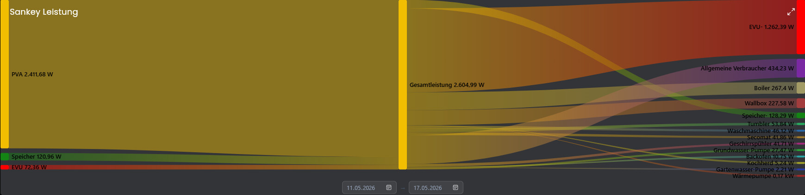

# Sankey
   Dieses Modul bietet die Möglichkeit ein Sankey Diagramm in Symcon darzustellen.
 
   ## Inhaltverzeichnis
- [Sankey](#sankey)
  - [Inhaltverzeichnis](#inhaltverzeichnis)
    - [1. Funktionsumfang](#1-funktionsumfang)
    - [2. Vorraussetzungen](#2-vorraussetzungen)
    - [3. Einrichten der Instanzen in IP-Symcon](#3-einrichten-der-instanzen-in-ip-symcon)
    - [4. Statusvariablen](#4-statusvariablen)
    - [5. PHP-Befehlsreferenz](#5-php-befehlsreferenz)
  - [6. Spenden](#6-spenden)
  - [7. Lizenz](#7-lizenz)
   
### 1. Funktionsumfang

* Anlegen von Verbindungen
* Anpassung des Diagramm Titels
* Anpassung der Farben
* Sobald eine Variable geändert wird, die sich im Diagramm befindet, wird das Diagramm aktualisiert
### 2. Vorraussetzungen

- IP-Symcon ab Version 8.0

### 3. Einrichten der Instanzen in IP-Symcon

 Unter 'Instanz hinzufügen' ist das 'Sankey'-Modul unter dem Hersteller 'Kai Schnittcher' aufgeführt.

__Konfigurationsseite__:

Name     | Beschreibung
-------- | ------------------
Label Farbe | Hier kann die Farbe der Labels im Diagramm  eingestellt werden.
Werte an Nodes anzeigen | Hier kann eingestellt werden, ob die Werte an den Nodes zusätzlich angezeigt werden.
Statisches Diagramm | Hier kann eingestellt werden, ob es sich um ein statisches Diagramm handelt, das heißt in der Visu kann der Zeitraum angegeben werden.
Verbindungen | Hier wird das Diagramm konfiguriert

__Verbindungen__:
Name     | Beschreibung
-------- | ------------------
Quele (Von) | Hier wird die Quelle hinterlegt, wo der Fluss für die Variable anfängt.
Ziel  (Nach) | Hier wird das Ziel hinterlegt, wo der Fluss für die Variable endet.
Variable | Hier wird die Variable hinterlegt, welche für diesen Fluss genutzt werden soll.
Invertieren | Diese Einstellung dreht das Vorzeichen der Variable um.
<0 ignorieren | Diese Einstellung lässt keine negative Werte zu, dazu gibt es Sonderfälle, siehe unten.
Farbe | Hier wird die Farbe für den Fluss angegeben

__Sonderfälle__:

**Statisches Diagramm, Standard Aggregation und < 0 ignorieren
Wird die Funktion <0 ignorieren nicht gesetzt, werden Erzeuger / Verbraucher bei entsprechenden Variablenwerten auf beiden Seiten dargestellt.** \

Sobald hier die Funktion <0 ignorieren gesetzt wird, werden Erzeuger / Verbraucher ggf. auf beiden Seiten, dargestellt.

<ins>Beispiel:</ins>
EVU und Batterie stehen auf beiden Seiten, dies bedeutet in diesem Fall nichts anders, als das in diesem Zeitraum im Durchschnitt

Der Speicher 120,96 Watt geliefert hat und mit 128,29 Watt geladen wurden.

Der Versorger hat im Durchschnitt 72,36 Watt geliefert und es wurde im Durchschnitt 1262,39 Watt eingespeist.

**Dynamisches Diagramm, Standard Aggregation und < 0 ignorieren
Wird <0 ignorieren nicht gewählt, wechselt der Eintrag automatisch die Seite, sobald sich hier das Vorzeichen ändert**

<ins>Beispiel:</ins>
Wenn eine Batterie Strom liefert, steht diese auf der linken Seite, sobald die Batterie geladen wird, landet sie auf der anderen Seite des Flusses.

### 4. Statusvariablen

Die Statusvariablen/Kategorien werden automatisch angelegt. Das Löschen einzelner kann zu Fehlfunktionen führen.

### 5. PHP-Befehlsreferenz

**SD_UpdateDiagram(integer $InstanceID)** \
Mit dieser Funktion kann das Diagramm neu erstellt werden.

## 6. Spenden

Dieses Modul ist für die nicht kommerzielle Nutzung kostenlos, Schenkungen als Unterstützung für den Autor werden hier akzeptiert:    

 <a href="https://www.amazon.de/hz/wishlist/ls/3JVWED9SZMDPK?ref_=wl_share" target="_blank">Amazon Wunschzettel</a>

## 7. Lizenz

[CC BY-NC-SA 4.0](https://creativecommons.org/licenses/by-nc-sa/4.0/)